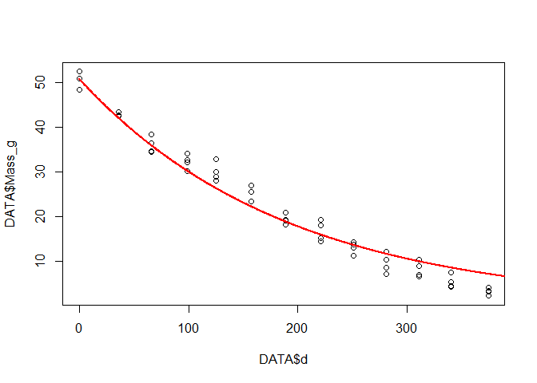

Oil palm decomposition
================
Marcus Schmidt
8 November 2019

### Background

This study was done on oil-palm plantations in Indonesia on two differen soil types.

### The code

Let's fist load our library. It is the tidyverse library, which includes useful tools for data handling and visualization, i.e. the ggplot 2 package.

``` r
library("tidyverse")
```

Next, I am going to load my data from the .txt file I created and look at the first 5 observations too see what's going on:

``` r
DATA=read.table("data/schmidt-nut-data.txt",h=T)
head(DATA)
```

You may also want to try

``` r
View(DATA)
```

to see the whole data set.

We now want to look at the first soil type (Clay Acrisol) at the first site, so we create a subset like this, using the pipe (%&gt;%) from the tidyverse package. Then we check if this really worked.

``` r
DATA<-DATA%>%filter(Plot == "C1")
unique(DATA$Plot)
```

    ## [1] C1
    ## Levels: C1 C2 L1 L2

The next part is key! We are plotting our Data - days and mass, fit an exponential cuve and retrieve k, our decomposition rate:

``` r
xx <- seq(0,605, length=1500)
plot(DATA$Mass_g 
     ~ DATA$d)
y <- DATA$Mass_g
x <- DATA$d
fit <- nls(y ~ (50.81 * 2.718^(-k * x)), start=list(k=0.00001))
lines(xx, predict(fit, data.frame(x=xx)), col="red", lwd=2, lty=1)
```



``` r
summary(fit)
```

    ## 
    ## Formula: y ~ (50.81 * 2.718^(-k * x))
    ## 
    ## Parameters:
    ##    Estimate Std. Error t value Pr(>|t|)    
    ## k 0.0052707  0.0001223    43.1   <2e-16 ***
    ## ---
    ## Signif. codes:  0 '***' 0.001 '**' 0.01 '*' 0.05 '.' 0.1 ' ' 1
    ## 
    ## Residual standard error: 2.582 on 51 degrees of freedom
    ## 
    ## Number of iterations to convergence: 6 
    ## Achieved convergence tolerance: 5.804e-07

In the output above, we are given the k and some information on how well it fits the observed data.
