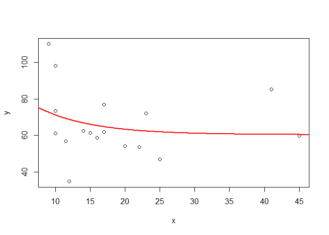
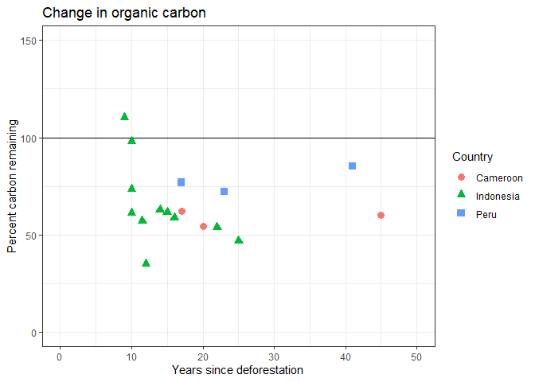
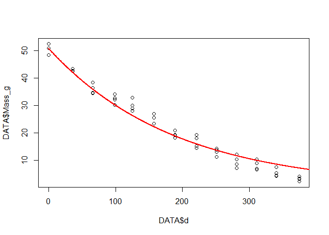
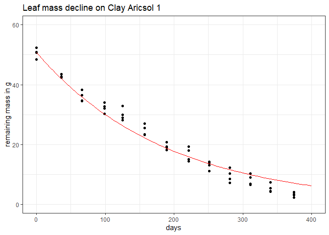
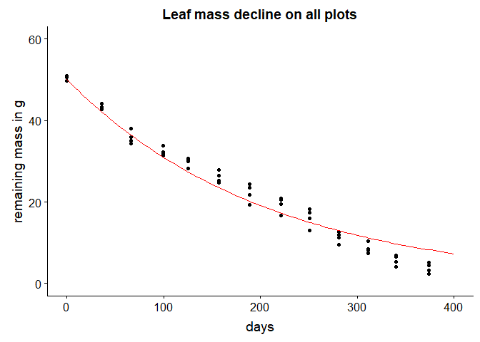
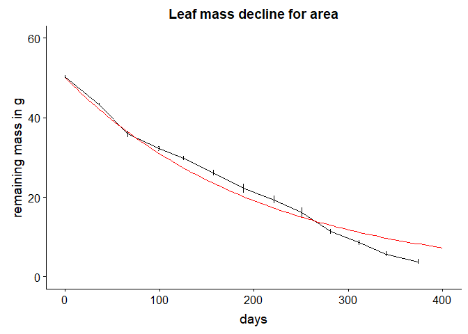

Oil palm SOC and leaf litter decomposition
================
Marcus Schmidt
8 November 2019

### Background

In the following course, we are looking at two processes in oil palm
plantations: 1) Soil organic carbon (SOC) remaining after deforestation
and 2) Decomposition of oil palm leafs

### Part 1 - SOC remaining

This data is part of a study on deforestation and land luse conversion
in Indonesia, Cameroon and Peru. You can find the whole paper here:
<https://www.pnas.org/content/112/32/9956>

Let’s fist load our library. It is the tidyverse library, which includes
useful tools for data handling and visualization, i.e. the ggplot 2
package.

``` r
library("tidyverse")
```

Let’s now read in our data and look at the upper part:

``` r
DATA=read.csv("data/van-straaten-soc.csv",h=T)
head(DATA)
```

I like to shorten our variables a little bit, it will be easier to type
then:

``` r
DATA$t<-DATA$Time.since.Deforestation
DATA$soc_pc<-DATA$SOC_prop_top10_C2
```

Next, I apply a filter to exclude observations that don’t state the
country. We also want only oil palm observations and lastly, clay
content shouldn’t change more than 20%.

``` r
DATA<-DATA%>%filter(Country!="")%>%filter(Landuse == "Oil palm")
DATA<-DATA%>%filter(abs(d_Clay_50to100)<20)
```

Now, for some of the following coding, it’s easier to give a shorter
name to some variables. We choose x and y because this we will have on
our axes:

``` r
y <- DATA$soc_pc #
x <- DATA$t
```

Let’s plot this in a very basic form, do the fitting and then add the
line:

``` r
xx <- seq(0,50, length=500)
plot(y~x)

fit2=nls(y~a+(100-a)*exp(-k*x),start=list(a=60, k=0.15), algorithm="port")

lines(xx, predict(fit2, data.frame(x=xx)), col="red", lwd=2, lty=1)
```

<!-- -->

``` r
summary(fit2)
```

    ## 
    ## Formula: y ~ a + (100 - a) * exp(-k * x)
    ## 
    ## Parameters:
    ##   Estimate Std. Error t value Pr(>|t|)    
    ## a  60.4117     9.9786   6.054 2.21e-05 ***
    ## k   0.1296     0.1066   1.216    0.243    
    ## ---
    ## Signif. codes:  0 '***' 0.001 '**' 0.01 '*' 0.05 '.' 0.1 ' ' 1
    ## 
    ## Residual standard error: 17.99 on 15 degrees of freedom
    ## 
    ## Algorithm "port", convergence message: relative convergence (4)
    ##   (4 observations deleted due to missingness)

This is a nice summary, but how do we extract k, for example?

``` r
summary(fit2)$coefficients
```

    ##     Estimate Std. Error  t value     Pr(>|t|)
    ## a 60.4117293  9.9785659 6.054149 2.206424e-05
    ## k  0.1296153  0.1065655 1.216297 2.426658e-01

``` r
k <- summary(fit2)$coefficients[2,1]
k
```

    ## [1] 0.1296153

#### Calculating turnover time

k can be though of as the fraction of organic carbon that is lost every
year. We can therefore calculate turnover time by 1/k. 1 is the whole of
the carbon at the beginning so how many k’s (fractions per year) do we
need to lose until everything is gone/turned over?

``` r
turnover_time <-  1/k
turnover_time
```

    ## [1] 7.715138

``` r
print(paste0("Our turnover time is: ",round(turnover_time,2)," years"))
```

    ## [1] "Our turnover time is: 7.72 years"

The plot will look much nicer in ggplot2, however:

``` r
g2 <- ggplot(DATA,aes(t,soc_pc, shape = Country, colour = Country)) +
    geom_hline(yintercept=100) +
  xlim(0,50) +
  ylim(0,150) +
  geom_point(show.legend = T, size = 3) +
  ggtitle("Change in organic carbon") +
  xlab("Years since deforestation") +
  ylab("Percent carbon remaining") +
  theme_bw()
g2
```

<!-- -->

Finally, we will add the curve to our ggplot:

``` r
func3<- function(x) {60.4+(100-60.4)*exp(-0.1296*x)}

g2 +
  stat_function(fun = func3, xlim=c(0,400), col = "blue", size = 1) 
```

<!-- -->

#### Exercise (to be added to course folder):

Add your name and the turnover time into the plot using annotate().
Create a PDF file including your plot and the code you. Add this to the
course folder.

### Part 2a - Decomposition of Clay Acrisol 1

This data was collected in Indonesia where oil palm leafs are put in
between oil palm rows and left there to decompose.

I am first going to load my data from the .txt file I created and look
at the first 5 observations too see what’s going on:

``` r
DATA=read.table("data/leaf-decomp-data.txt",h=T)
head(DATA)
```

You may also want to try

``` r
View(DATA)
```

to see the whole data set.

We now want to look at the first soil type (Clay Acrisol) at the first
site, so we create a subset like this, using the pipe (%\>%) from the
tidyverse package. Then we check if this really worked.

``` r
DATA<-DATA%>%filter(Plot == "C1")
unique(DATA$Plot)
```

    ## [1] C1
    ## Levels: C1 C2 L1 L2

The next part is key\! We are plotting our Data - days and mass, fit an
exponential cuve and retrieve k, our decomposition rate:

``` r
xx <- seq(0,605, length=1500)
plot(DATA$Mass_g 
     ~ DATA$d)
y <- DATA$Mass_g
x <- DATA$d
fit <- nls(y ~ (50.81 * 2.718^(-k * x)), start=list(k=0.00001))
lines(xx, predict(fit, data.frame(x=xx)), col="red", lwd=2, lty=1)
```

<!-- -->

``` r
summary(fit)
```

    ## 
    ## Formula: y ~ (50.81 * 2.718^(-k * x))
    ## 
    ## Parameters:
    ##    Estimate Std. Error t value Pr(>|t|)    
    ## k 0.0052707  0.0001223    43.1   <2e-16 ***
    ## ---
    ## Signif. codes:  0 '***' 0.001 '**' 0.01 '*' 0.05 '.' 0.1 ' ' 1
    ## 
    ## Residual standard error: 2.582 on 51 degrees of freedom
    ## 
    ## Number of iterations to convergence: 6 
    ## Achieved convergence tolerance: 5.804e-07

In the output above, we are given the k and some information on how well
it fits the observed data.

We made the plot using the basic plot package in R. However, in order to
get a much nicer plot, I recommend using the ggplot 2 package. It’s
already included in the tidyverse library we installed earlier.

We first define the function including k, which we get from above and
define what data we want to use:

``` r
func1<- function(x) {50.81 * 2.718^(-0.0052707 * x)}
dat1 = data.frame(x = DATA$d, y = DATA$Mass_g)
```

Now we define the plot:

``` r
g1 <- ggplot(dat1,aes(x,y)) +
  xlim(0,400) +
  ylim(0,60) +
  geom_point(show.legend = FALSE) +
  ggtitle("Leaf mass decline on Clay Aricsol 1") +
  xlab("days") +
  ylab("remaining mass in g") +
  stat_function(fun = func1, xlim=c(0,400), col = "red")
g1
```

And this is what we get:
<!-- -->

To save your plot in a folder called figs within your project, we can
use the cowplot package.

``` r
library(cowplot)
ggsave("figs/oil-palm-decomp.png", plot = g1, width = 10, height = 10)
```

### Part 2b - Decomposition representing the whole study area

We have previously looked at one of our plots but that does not
represent our whole study area. Also, we want to get rid of our subplots
because only our plots are true replicates.

So first we read in our data and only keep the first 5 columns:

``` r
DATA=read.table("data/leaf-decomp-data.txt",h=T)
names(DATA)
```

    ##  [1] "Time"    "day"     "Plot"    "Subplot" "Mass_g"  "Al_mg_L" "Ca_mg_L"
    ##  [8] "Cd_ppb"  "Co_ppb"  "Cr_ppb"  "Cu_ppb"  "Fe_mg_L" "K_mg_L"  "Mg_mg_L"
    ## [15] "Mn_mg_L" "Na_mg_L" "Ni_ppb"  "P_mg_L"  "Pb_ppb"  "S_mg_L"  "Zn_ppb" 
    ## [22] "tot_C_." "tot_N_." "C_N"

``` r
selection<-names(DATA)[1:5]
DATA<-DATA%>%select(selection)
head(DATA)
```

    ##   Time day Plot Subplot Mass_g
    ## 1   T0   0   C1       1  50.81
    ## 2   T0   0   C1       2  52.41
    ## 3   T0   0   C1       3  48.41
    ## 4   T0   0   C1       4  50.89
    ## 5   T0   0   C2       5  47.51
    ## 6   T0   0   C2       6  51.19

We then group and summarize our data - assigning a mean for each plot
and day. For our example this means that we do not anymore distinguish
by subplot.

``` r
DATA<-DATA%>%group_by(day, Time, Plot)%>%summarize(plot_mass_g = mean(Mass_g))
DATA<-data.frame(DATA)
head(DATA)
```

    ##   day Time Plot plot_mass_g
    ## 1   0   T0   C1     50.6300
    ## 2   0   T0   C2     49.7450
    ## 3   0   T0   L1     49.7350
    ## 4   0   T0   L2     51.0350
    ## 5  36   T1   C1     42.7625
    ## 6  36   T1   C2     43.0850

Now we define our x, our y and the sequence for our fitting

``` r
x<-DATA$day
y<-DATA$plot_mass_g
xx <- seq(0,400, length=800)
```

Next is the fitting itself. Again, we take 50g as the basis from which
decomposition starts.

``` r
fit <- nls(y ~ (50 * exp(-k * x)), start=list(k=0.00001))
summary(fit)
```

To have it handy later, we are saving our k of the fit

``` r
k<-0.0048034
```

You can now do the simple plot like this, but I will not show it here:

``` r
# plot(x,y)
# lines(xx, predict(fit, data.frame(x=xx)), col="red", lwd=2, lty=1)
```

Instead, let’s do it with ggplot:

``` r
func1<-func1<- function(x) {50 * exp(-k * x)}

g1 <- ggplot(,aes(x,y)) +
  xlim(0,400) +
  ylim(0,60) +
  geom_point(show.legend = FALSE) +
  ggtitle("Leaf mass decline on all plots") +
  xlab("days") +
  ylab("remaining mass in g") +
  stat_function(fun = func1, xlim=c(0,400), col = "red") 
g1
```

<!-- -->

This looks nice alreay, but to give a more common representation, let’s
make it a line that includes the plot means and standard errors for each
month:

``` r
DATA<-DATA%>%group_by(day,Time)%>%summarize(mean_mass_g = mean(plot_mass_g), se_g = sd(plot_mass_g/sqrt(4)))
head(DATA)
```

    ## # A tibble: 6 x 4
    ## # Groups:   day [6]
    ##     day Time  mean_mass_g  se_g
    ##   <int> <fct>       <dbl> <dbl>
    ## 1     0 T0           50.3 0.326
    ## 2    36 T1           43.3 0.274
    ## 3    66 T2           35.9 0.780
    ## 4    99 T3           32.3 0.503
    ## 5   125 T4           29.9 0.537
    ## 6   157 T5           26.1 0.697

``` r
x<-DATA$day
y<-DATA$mean_mass_g
z<-DATA$se_g # for error visability

library(sciplot)

g2 <- ggplot(,aes(x,y)) +
  xlim(0,400) +
  ylim(0,60) +
  geom_line(show.legend = FALSE) +
  ggtitle("Leaf mass decline for area") +
  xlab("days") +
  ylab("remaining mass in g") +
  stat_function(fun = func1, xlim=c(0,400), col = "red")  +
  geom_errorbar(aes(ymin=y-z, ymax=y+z), colour="black", width=.1) 
g2
```

<!-- -->
