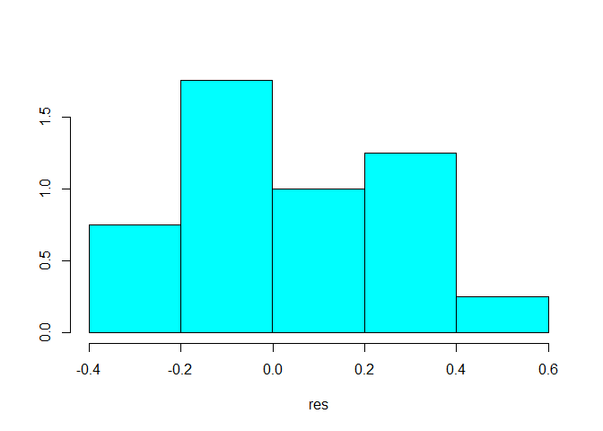
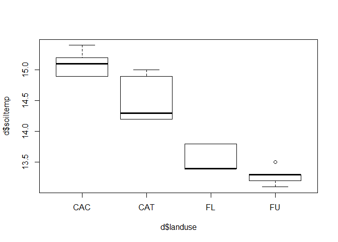
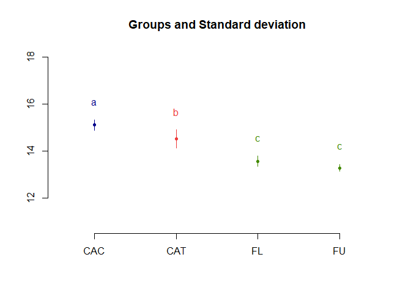

Multi-group basic stats
================
Marcus Schmidt
3 December 2019

## Background

In this exercise, we will compare four groups (land uses) statistically
to see if there are significant differences. A significance level of p =
0.05 means that there is a probability of less than 5% that what we find
is just coincidence. So we are 95% sure of our result.

## Data arrangement

``` r
library(tidyverse)
library(readxl)
```

This time, let’s read in our data directly from Excel. We do this using
the readxl package that we loaded above. Since the second row is units,
we just keep everything starting with row 2.

``` r
d<-read_xlsx("data/pract-data-summary.xlsx")%>%slice(2:1000)
head(d)
```

    ## # A tibble: 6 x 11
    ##   `land use` replicate `bulk density` SOC   `total N` `Effective cati~
    ##   <chr>      <chr>     <chr>          <chr> <chr>     <chr>           
    ## 1 Cropland ~ AFc1      1.17195223460~ 817.~ 91.93787~ 579.29433213742~
    ## 2 Cropland ~ AFc2      1.56695394495~ 832.~ 86.83022~ 429.70941274956~
    ## 3 Cropland ~ AFc3      1.36094116707~ 1041~ 97.04554~ 348.93042827028~
    ## 4 Cropland ~ AFc4      1.14614109111~ 1399~ 132.7991~ 528.82156268514~
    ## 5 Cropland ~ AFc5      1.14218589444~ 1067~ 117.4761~ 502.15834059274~
    ## 6 Cropland ~ AFt1      1.21007427746~ 1205~ 86.83022~ 544.63504112409~
    ## # ... with 5 more variables: `N2 fixation` <chr>, `CO2 fluxes` <chr>, `N2O
    ## #   fluxes` <chr>, `CH4 fluxes` <chr>, `soil temp` <chr>

Let’ shorten our variables a little bit and take out the blanks in the
names:

``` r
names(d)
d<-d%>%dplyr::rename(
  landuse = 'land use',
  bd = 'bulk density',
  ecec = 'Effective cation exchange capacity',
  n2fix = 'N2 fixation',
  co2flux = 'CO2 fluxes',
  totn = 'total N',
  n2oflux = 'N2O fluxes',
  ch4flux = 'CH4 fluxes',
  soiltemp = 'soil temp'
)
```

Let’s see our new names:

``` r
names(d)
```

    ##  [1] "landuse"   "replicate" "bd"        "SOC"       "totn"      "ecec"     
    ##  [7] "n2fix"     "co2flux"   "n2oflux"   "ch4flux"   "soiltemp"

Looking at ‘head(d)’ shows us that landuse is of type character, but we
want it to be a factor with shorter names as well. Additionally, let’s
make all other variables numeric. Check with ‘head(d)’ again afterwards
to see if it worked.

``` r
d[[1]]<-as.factor(d[[1]])
levels(d[[1]])

library(plyr)
d$landuse<-mapvalues(d$landuse, from = levels(d[[1]]), 
              to = c("CAC", "CAT", "FL", "FU"))
detach(package:plyr)

class(d[[3]])<-"numeric" 
head(d)

for (i in list(4,5,6,7,8,9,10,11)) {
 class(d[[i]])<-"numeric" 
}
```

## Stats analysis: conditions

There are parametric tests that are more likely to detect differences,
but they assume that the data meet certain criteria. Hence, you are only
allowed to us them if the criteria (contitions) are met.

Two of the main conditions that need to be tested are normality and
homogeneity of variances. For each of them, we conduct a test but also
visually inspect our data to get a better impression.

``` r
# Normality: Shapiro-Wilk test of model residuals 
# (package stats):
shapiro.test(residuals(lm(d$soiltemp~d$landuse)))
```

    ## 
    ##  Shapiro-Wilk normality test
    ## 
    ## data:  residuals(lm(d$soiltemp ~ d$landuse))
    ## W = 0.92667, p-value = 0.1332

``` r
res<-residuals(lm(d$soiltemp~d$landuse))
library(MASS)
truehist(res)
```

<!-- -->

``` r
# Homogeneity of variances: Levene's test 
# (package car; may need package lme4 as well)
library(car)
leveneTest(d$soiltemp~d$landuse)
```

    ## Levene's Test for Homogeneity of Variance (center = median)
    ##       Df F value Pr(>F)
    ## group  3  0.8182 0.5026
    ##       16

``` r
plot(d$soiltemp~d$landuse)
```

<!-- -->

Both these tests fail if p \< 0.05 and conditions are met if p \> 0.05.

## Stats analysis: significance tests

Now that we tested these conditions we can decide on a parametric or
non-parametric test:

### Parametric data

``` r
# (both conditions hold with p > 0.05)
model1=aov(soiltemp  ~ landuse, data = d)
anova(model1)
```

    ## Analysis of Variance Table
    ## 
    ## Response: soiltemp
    ##           Df Sum Sq Mean Sq F value    Pr(>F)    
    ## landuse    3 10.697  3.5658  52.439 1.687e-08 ***
    ## Residuals 16  1.088  0.0680                      
    ## ---
    ## Signif. codes:  0 '***' 0.001 '**' 0.01 '*' 0.05 '.' 0.1 ' ' 1

``` r
# post-hoc test
library(agricolae)
result<-LSD.test(model1, "landuse", p.adj = "holm")
plot(result, variation = "SD")
```

<!-- -->

``` r
# try variation = "SE" - what happens?
```

### Non-parametric data

``` r
# (one/both of the conditions do not hold with p < 0.05)
kruskal.test(SOC~landuse, data=d)
```

    ## 
    ##  Kruskal-Wallis rank sum test
    ## 
    ## data:  SOC by landuse
    ## Kruskal-Wallis chi-squared = 15.48, df = 3, p-value = 0.001449

``` r
# post-hoc test
library(pgirmess)
kruskalmc(d$SOC~d$landuse, probs=0.05, cont=NULL) 
```

    ## Multiple comparison test after Kruskal-Wallis 
    ## p.value: 0.05 
    ## Comparisons
    ##         obs.dif critical.dif difference
    ## CAC-CAT     1.8     9.871455      FALSE
    ## CAC-FL     13.2     9.871455       TRUE
    ## CAC-FU      7.8     9.871455      FALSE
    ## CAT-FL     11.4     9.871455       TRUE
    ## CAT-FU      6.0     9.871455      FALSE
    ## FL-FU       5.4     9.871455      FALSE

Remember to only conduct a post-hoc test if your global test yields a p
\< 0.05.
